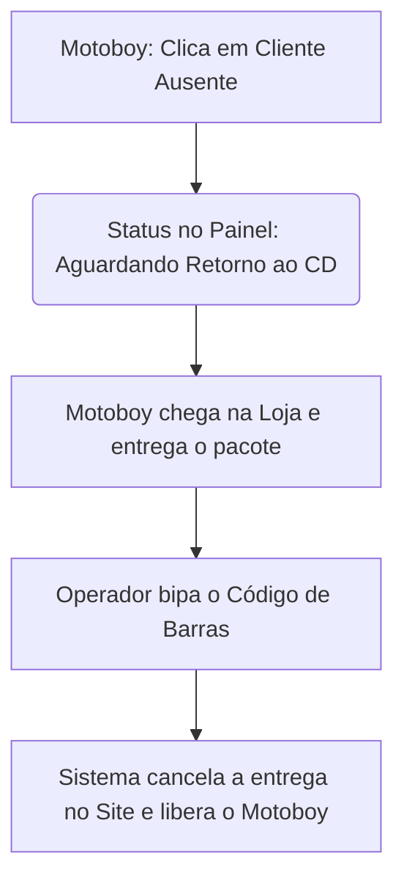
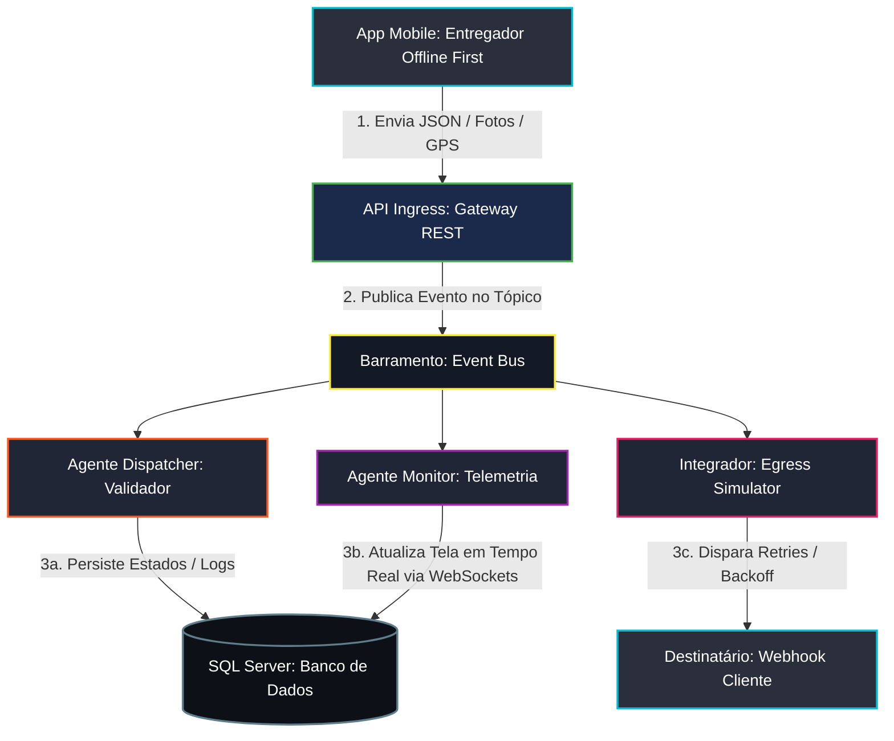

# Distre - Gestão de Entregas

Este projeto simula um ecossistema completo de rastreamento e orquestração de entregas de alto padrão operacional (padrão iFood, Loggi, Rappi), baseado em uma **Arquitetura Orientada a Eventos (EDA - Event-Driven Architecture)** e processamento em segundo plano orientado a **Agentes Inteligentes**.

O sistema é composto por um **Backend em Node.js com TypeScript** que persiste os dados localmente em um banco de dados **SQL Server Express**, e um **Frontend em React com TypeScript** que renderiza o barramento de eventos, mapas de telemetria e o simulador do aplicativo mobile do entregador.

---

## Detalhamento dos Processos Operacionais

### 1. Ciclo de Vida da Comanda (Estados Estritos)
Toda entrega (`pedido`) segue uma jornada de estados imutável e validada no barramento de eventos:
- **RECEBIDO**: Ingestão da entrega no sistema pelo operador (Gateway Ingress).
- **DESPACHADO**: Motorista da frota é localizado e vinculado, com geração automática da rota.
- **EM_TRANSITO**: Rota iniciada e telemetria GPS sendo transmitida em tempo real.
- **NO_LOCAL**: O entregador chega às coordenadas geográficas do destino.
- **ENTREGUE**: Sucesso na entrega (comprovado digital e fisicamente).
- **AGUARDANDO_RETORNO_CD**: Insucesso operacional. A mercadoria fica sob custódia temporária do motorista in trânsito de retorno.
- **PRODUTO_RETORNADO_ESTOQUE**: O conferente física bipa o item no Centro de Distribuição Central, finalizando o fluxo reverso.

---

### 2. Validação Geofencing e Critérios de Conclusão (POD)
Para mitigar fraudes e auditar entregas, a confirmação exige comprovação eletrônica de entrega (Proof of Delivery - POD):
- **Cerca Virtual (Geofencing)**: O botão "Confirmar Entrega" no simulador mobile é bloqueado se a coordenada GPS atual do motorista estiver a uma distância superior a ~100 metros (3 unidades na grade) do destino planejado.
- **Liberação por Justificativa**: Se o GPS falhar ou divergir, o entregador deve marcar a caixa de exceção e descrever textualmente a justificativa (ex: "Sem precisão no sinal GPS"), gerando um alerta visual no painel do operador.
- **Validação de POD Físico**: O entregador precisa obrigatoriamente fornecer:
  1. Nome por extenso do recebedor.
  2. CPF válido do recebedor.
  3. Foto anexada (Canhoto assinado, fachada ou portaria).
  4. Assinatura/rubrica digital.

---

### 3. Sincronização Estrita e Modo Offline (Edge Outbox Sync)
Em cenários de baixa conectividade, o aplicativo móvel armazena as interações localmente para sincronização futura:
- **Fila Outbox Local**: Ações de confirmação/falha de entrega realizadas offline são enfileiradas no `localStorage` do navegador.
- **Buffer de Telemetria**: Coordenadas GPS geradas durante a ociosidade da rede são acumuladas sequencialmente.
- **Flush em Lote**: Ao restabelecer a conexão (desmarcando a caixa "Offline"), o outbox dispara um envio em massa (bulk) da telemetria acumulada para remontar o mapa retrospectivo, seguido da sincronização do status final.

---

### 4. Gestão de Exceções Logísticas (Módulo 3)

#### A. Quebra de Sequência (Desvio de Rota)
- O sistema permite atribuir até **3 comandas simultâneas** para o mesmo entregador.
- O Dispatcher calcula a ordem de sequência lógica com base na proximidade espacial (`SEQUENCIA_ESPERADA`).
- Se o entregador entregar uma comanda subsequente sem ter finalizado a anterior, o barramento propaga o evento `AlertaDesvioSequencia` e a comanda pulada recebe um marcador visual piscante amarelo **"ROTA PULADA"** no mapa e nos painéis.

#### B. Ociosidade e Parada Não Programada (Stale Driver)
- Se um motorista permanecer parado no mesmo local por mais de **10 segundos** na simulação (equivalente a 15 minutos em ambiente real) com entregas ativas `EM_TRANSITO`, o sistema gera o alerta `AlertaParadaProlongada`.
- O ícone do veículo afetado começa a **piscar em vermelho em alta frequência** no mapa do painel para chamar a atenção do supervisor.

#### C. Rollback de Ações (Estorno de Status)
- Caso o entregador clique acidentalmente no botão de confirmar ou falhar, o simulador mobile exibe um botão para desfazer a ação.
- A **janela de tolerância é de 60 segundos** e exige que o entregador ainda esteja dentro da área de Geofencing. Ao acionar, a entrega volta para `NO_LOCAL` e o motorista retorna para o status `ocupado`.

#### D. Matriz de Motivos de Insucesso
Para evitar registros arbitrários, o insucesso exige a seleção de um código padronizado com comportamento de contingência associado:
- **01 - Cliente Ausente (3 tentativas de contato)**: Encaminha custódia reversa temporária.
- **02 - Endereço Não Localizado / Incompleto**: Abre incidente para retificação cadastral.
- **03 - Estabelecimento Fechado (Comercial)**: Aloca prioridade para reagendamento.
- **04 - Recusa por Avaria ou Item Incorreto**: Dispara aviso prioritário de reenvio no estoque.
- **05 - Falta de Segurança no Local (Área de Risco)**: Interrompe a rota imediatamente.

---

### 4.2. Fluxo Enxuto de Insucesso e Cancelamento (Módulo 3.2)

#### A. No Aplicativo Mobile: O Disparo do Insucesso
Quando o motoboy chega ao endereço e o cliente não atende (após tentativas de contato):
1. **Ação do Motoboy**: No app, ele seleciona a comanda e clica em **"Cliente Ausente / Devolver Pedido"**.
2. **Mudança Automática de Status**: A entrega assume instantaneamente o status **AGUARDANDO RETORNO AO CD** (ou À Loja/Restaurante).
3. **Trava de Segurança**: O app mantém essa comanda visível na tela do motoboy para indicar que ele possui um produto físico que precisa ser devolvido ao balcão.

#### B. No Painel Web: O Recebimento e Cancelamento Automático
Assim que o motoboy bota o pé de volta na farmácia ou no restaurante:
1. **O Bipe de Retorno**: O operador do caixa/despacho clica no botão verde **"Bipar Código de Barras (Retorno ao Estoque)"** e lê a comanda física que voltou com o motoboy.
2. **Ação Automática do Sistema (O Cancelamento)**: Ao processar esse bipe, o sistema executa três ações automáticas em segundo plano:
   - **Finaliza a Entrega**: O status da comanda muda para CANCELADO / DEVOLVIDO (PRODUTO_RETORNADO_ESTOQUE).
   - **Libera o Motoboy**: O motoboy (Ex: Bob - Moto-02) é limpo daquela pendência na hora e seu status volta para **Disponível** para puxar a próxima entrega.
   - **Integração de Cancelamento (Vendas)**: O site/sistema de vendas recebe o evento `delivery.canceled` para estornar o pagamento (se for cartão/Pix online) ou para que o atendente saiba que aquele pedido foi abortado na rua.

#### C. Fluxograma do Processo Simplificado


---


### 5. Motor de Eventos do Monitor e Notificações (Egress) (Módulo 4)

#### A. Processamento do Agente Monitor
O Agente Monitor atua de forma proativa processando eventos em tempo real transmitidos pelo barramento de mensagens para atualizar métricas e painéis sem sobrecarregar a base de dados relacional:
- **GPS_HEARTBEAT**: Transmite as coordenadas geográficas em tempo real do motoboy para atualização do componente de telemetria visual.
- **COMANDA_ENTREGUE**: Atualiza de forma otimista a fila de entregas pendentes vinculadas ao motorista, incrementando o contador agregado de sucesso e removendo o marcador de geolocalização no mapa.
- **ALERTA_GERADO**: Altera o estado do card do Agente Monitor na topologia para "Atenção" (status warning) ou "Crítico" (status critical), dependendo da gravidade informada pelo incidente, registrando a mensagem na linha do tempo.

#### B. Cálculo de ETA Dinâmico e Alerta Precoce
A cada 3 batimentos consecutivos de telemetria (GPS_HEARTBEAT), o monitor recalcula a distância Euclidiana linear até o destino da próxima comanda pendente na sequência lógica do entregador.
Se a velocidade do veículo cair abaixo de 30% da velocidade nominal planejada para o seu tipo de veículo (indicando tráfego pesado ou retenção severa), o monitor altera imediatamente o status da entrega para SLA_ALERTA. Esse comportamento antecipa gargalos logísticos antes de se tornarem atrasos reais consolidados.

#### C. Políticas de Retentativas e Dead Letter Queue (DLQ)
A comunicação com sistemas terceiros (ERP, CRM) via webhooks (Egress Simulator) utiliza uma política estrita de retentativas assíncronas com Exponential Backoff para tolerar falhas de infraestrutura externa:
1. **Tentativa 1**: Disparo imediato logo após a conclusão da entrega.
2. **Tentativa 2**: Executada após 5 segundos em caso de falha inicial.
3. **Tentativa 3**: Executada após 25 segundos se o erro persistir.
4. **Tentativa 4**: Executada após 120 segundos (2 minutos).
5. **Tentativa 5**: O webhook é rotulado permanentemente como "Falhado" na interface para fins de auditoria, e o payload correspondente é encaminhado para a Dead Letter Queue (DLQ), cessando novas chamadas.

#### D. Payload de Integração Padronizado
O payload despachado nas notificações do Integrador de saída segue uma estrutura corporativa fixa:
```json
{
  "event_id": "EVT_883921_XYZ",
  "event_type": "delivery.completed",
  "timestamp": "2026-05-26T14:15:00-03:00",
  "data": {
    "comanda_id": "del-E209",
    "cliente": "Lojas Americanas",
    "entregador": {
      "id": "drv-02",
      "nome": "Bob (Moto-02)"
    },
    "conclusao": {
      "coordenadas_entrega": {
        "lat": -23.55052,
        "lng": -46.63330
      },
      "recebedor_nome": "Marcos Oliveira",
      "recebedor_documento": "123.456.789-00",
      "assinatura_url": "https://storage.sistema.com/signatures/del-E209.png",
      "foto_fachada_url": "https://storage.sistema.com/photos/del-E209.jpg"
    }
  }
}
```

---

## API Pública de Integração — Ingestão de Pedidos

Endpoint dedicado para que sistemas externos (e-commerce, PDV, marketplaces, bots) enviem pedidos diretamente para a fila de comandas da loja. O pedido entra no ciclo de vida normal (`RECEBIDO` → ...) e é propagado em tempo real para o painel via WebSocket.

### `POST /api/integracao/pedidos`

**Autenticação:** header `X-Loja-Id: <uuid-da-loja>` (ou campo `lojaId` no body). A loja precisa estar cadastrada no sistema multi-tenant.

**Headers**
```
Content-Type: application/json
X-Loja-Id: 41869dbf-4b09-4933-8bd2-11e60ccc092d
```

**Payload**
```json
{
  "cliente": {
    "nome": "João da Silva",
    "telefone": "+5511999998888",
    "documento": "123.456.789-00"
  },
  "produtos": [
    { "nome": "X-Burguer", "quantidade": 2, "precoUnitario": 25.00 },
    { "nome": "Refrigerante 350ml", "quantidade": 1, "precoUnitario": 7.00, "observacao": "Bem gelado" }
  ],
  "valores": {
    "subtotal": 57.00,
    "taxaEntrega": 8.00,
    "desconto": 0,
    "total": 65.00
  },
  "endereco": {
    "logradouro": "Rua das Flores",
    "numero": "123",
    "complemento": "Apto 42",
    "bairro": "Centro",
    "cidade": "São Paulo",
    "uf": "SP",
    "cep": "01000-000",
    "referencia": "Próximo à padaria"
  },
  "pagamento": { "forma": "pix", "troco": 0 },
  "prioridade": "media",
  "tipoCarga": "normal",
  "observacao": "Entregar após 19h",
  "idPedidoExterno": "EXT-1234"
}
```

**Campos obrigatórios**
- `cliente.nome`
- `produtos[]` com pelo menos 1 item, cada um contendo `nome` e `quantidade > 0`
- `endereco.logradouro`

**Campos opcionais / com default**
- `valores.subtotal` e `valores.total` são calculados automaticamente a partir de `precoUnitario × quantidade` quando ausentes.
- `pagamento.forma` aceita `pix | dinheiro | maquininha | credito | debito | cartao | cartao_credito | cartao_debito` (mapeado internamente para o enum `FormaPagamento` — variantes de cartão viram `maquininha`).
- `prioridade`: `baixa | media | alta | critica` (default `media`).
- `tipoCarga`: `normal | expressa | agendado` (default `normal`).

**Comportamento**
- Se a loja tem `recebePedidos = true`, a comanda é criada como `tipoComanda: 'pedido'` (fluxo de preparo: `RECEBIDO` → `EM_PREPARO` → finalização gera comanda de entrega).
- Caso contrário, entra como `tipoComanda: 'entrega'` e é publicada no broker no tópico `entrega.recebida`, acionando o Agente Dispatcher.

**Resposta `201 Created`**
```json
{
  "success": true,
  "pedidoId": "COMANDA-0042",
  "status": "RECEBIDO",
  "tipoComanda": "pedido",
  "total": 65,
  "subtotal": 57,
  "taxaEntrega": 8,
  "desconto": 0
}
```

**Erros**
- `400` — header `X-Loja-Id` ausente, payload inválido ou campos obrigatórios faltando.
- `404` — `lojaId` informado não existe.
- `500` — falha interna ao persistir no SQL Server.

**Exemplo `curl`**
```bash
curl -X POST http://localhost:5000/api/integracao/pedidos \
  -H "Content-Type: application/json" \
  -H "X-Loja-Id: 41869dbf-4b09-4933-8bd2-11e60ccc092d" \
  -d '{
    "cliente": { "nome": "João da Silva", "telefone": "+5511999998888" },
    "produtos": [{ "nome": "X-Burguer", "quantidade": 2, "precoUnitario": 25.00 }],
    "endereco": { "logradouro": "Rua das Flores, 123", "bairro": "Centro", "cidade": "São Paulo" },
    "pagamento": { "forma": "pix" }
  }'
```

### `POST /api/integracao/entregas`

Endpoint específico para **ERPs externos** despacharem comandas de **entrega já prontas** — a venda foi concluída no ERP, o produto está separado/faturado e só precisa ser entregue. Diferente de `/pedidos`, esta rota **ignora o flag `recebePedidos`** da loja: a comanda é sempre criada como `tipoComanda: 'entrega'` e publicada imediatamente no broker no tópico `entrega.recebida`, acionando o Agente Dispatcher para alocar um motoboy.

**Quando usar cada endpoint:**
| Cenário | Endpoint | tipoComanda | Fluxo |
|---|---|---|---|
| Pedido novo (precisa preparo: cozinha, separação, etc.) | `/api/integracao/pedidos` | `pedido` ou `entrega` (depende de `recebePedidos`) | `RECEBIDO` → `EM_PREPARO` → finalização cria entrega |
| Venda já fechada no ERP, produto pronto para sair | `/api/integracao/entregas` | sempre `entrega` | `RECEBIDO` → despacho automático |

**Autenticação:** idêntica à `/pedidos` — header `X-Loja-Id: <uuid-da-loja>`.

**Payload** (mesmo esquema de `/pedidos`, com dois campos adicionais opcionais):
```json
{
  "cliente": {
    "nome": "Maria Souza",
    "telefone": "+5511988887777",
    "documento": "987.654.321-00"
  },
  "produtos": [
    { "nome": "Notebook Dell Inspiron 15", "quantidade": 1, "precoUnitario": 4299.00 },
    { "nome": "Mouse sem fio", "quantidade": 1, "precoUnitario": 89.90 }
  ],
  "valores": {
    "subtotal": 4388.90,
    "taxaEntrega": 0,
    "desconto": 0,
    "total": 4388.90
  },
  "endereco": {
    "logradouro": "Av. Paulista",
    "numero": "1578",
    "complemento": "Sala 1203",
    "bairro": "Bela Vista",
    "cidade": "São Paulo",
    "uf": "SP",
    "cep": "01310-200",
    "referencia": "Edifício comercial, recepção até 18h"
  },
  "pagamento": { "forma": "credito" },
  "prioridade": "alta",
  "tipoCarga": "expressa",
  "observacao": "Mercadoria frágil — manusear com cuidado",
  "numeroPedidoErp": "NF-2026-00031245",
  "origemErp": "TOTVS Protheus",
  "idPedidoExterno": "OS-87231"
}
```

**Campos adicionais (em relação a `/pedidos`)**
- `numeroPedidoErp` (opcional): número do pedido/NF no sistema ERP de origem.
- `origemErp` (opcional): identificação do ERP que originou a entrega (TOTVS, SAP, Bling, Tiny, etc.).

Esses dois campos são concatenados em `referencia` da comanda para rastreabilidade e aparecem no painel/comprovante.

**Resposta `201 Created`**
```json
{
  "success": true,
  "entregaId": "COMANDA-0043",
  "status": "RECEBIDO",
  "tipoComanda": "entrega",
  "total": 4388.90,
  "subtotal": 4388.90,
  "taxaEntrega": 0,
  "desconto": 0
}
```

**Erros:** mesmos códigos de `/pedidos` (`400`, `404`, `500`).

**Exemplo `curl`**
```bash
curl -X POST http://localhost:5000/api/integracao/entregas \
  -H "Content-Type: application/json" \
  -H "X-Loja-Id: 41869dbf-4b09-4933-8bd2-11e60ccc092d" \
  -d '{
    "cliente": { "nome": "Maria Souza", "documento": "987.654.321-00" },
    "produtos": [{ "nome": "Notebook Dell", "quantidade": 1, "precoUnitario": 4299.00 }],
    "endereco": { "logradouro": "Av. Paulista, 1578", "bairro": "Bela Vista", "cidade": "São Paulo" },
    "pagamento": { "forma": "credito" },
    "prioridade": "alta",
    "tipoCarga": "expressa",
    "numeroPedidoErp": "NF-2026-00031245",
    "origemErp": "TOTVS Protheus"
  }'
```

---

## Banco de Dados (SQL Server)

### Bancos e conexão

| Banco | Uso | Onde é configurado |
|---|---|---|
| `DISTRE_PROD` | **Produção** — o que roda no PM2 e atende os clientes | `backend/.env` → `DB_DATABASE=DISTRE_PROD` |
| `GESTAO_DADOS` | Desenvolvimento/testes (`npm run dev`) | padrão quando `DB_DATABASE` não está no `.env` |

- Servidor: `localhost\SQLEXPRESS`, **Autenticação Integrada do Windows** (driver `msnodesqlv8`). Para SQL gerenciado/Azure use `DB_DRIVER=tedious` + `DB_USER`/`DB_PASSWORD` (ver `backend/.env.example` e `backend/docs/DEPLOY_AZURE.md`).
- Datas são gravadas como texto ISO 8601 (`VARCHAR(100)`), em UTC.
- Campos com estrutura (itens, rota, telemetria, snapshot da nota) ficam em JSON dentro de `NVARCHAR(MAX)`.

### Como a estrutura é criada

O backend **cria e migra as tabelas sozinho ao subir** (`IF NOT EXISTS` + `ALTER TABLE ... ADD` para colunas novas):

- `backend/src/database.ts` → `inicializarBanco()`: ENTREGAS, LOGS_EVENTOS, ADMINISTRADORES, MOTORISTAS, EMPRESAS, LOJAS, TIPOS_VEICULOS, PRODUTOS, PLANOS, ASSINATURAS_EMPRESAS, FATURAS, HISTORICO_PAGAMENTOS, CONFIGURACOES_COBRANCA, WEBHOOK_EVENTS, LEDGER_FINANCEIRO (+ trigger), SESSOES.
- `backend/src/fiscal/fiscalRepo.ts` → `garantirTabelasFiscais()` (no primeiro uso do módulo fiscal): CONFIG_FISCAL_LOJA, CREDENCIAIS_FISCAIS, NOTAS_FISCAIS.

Ou seja: **para recuperar só a estrutura basta criar um banco vazio e subir o backend.** Como cópia em texto independente do código existe também **`backend/docs/schema-completo.sql`** (gerado do banco real), que recria tudo com `sqlcmd`.

**Dados iniciais criados automaticamente** (se a tabela estiver vazia): 4 tipos de veículo, 4 planos (Bronze, Silver, Gold, Enterprise), a linha `default` de CONFIGURACOES_COBRANCA e o administrador `admin`. Com `SEED_DEMO=false` (produção) não são criados produtos/empresas de demonstração.

### O que NÃO fica no banco (faça backup junto!)

| Item | Onde fica | Por que importa |
|---|---|---|
| Fotos de produtos e logos | `backend/uploads/` | `PRODUTOS.IMAGEM_URL` e `LOJAS.LOGO_URL` apontam para `/uploads/<arquivo>` |
| Chave do cofre fiscal | `backend/.chave-fiscal` (ou `FISCAL_CHAVE_CRIPTOGRAFIA` no `.env`) | sem ela, certificado/CSC/tokens em `CREDENCIAIS_FISCAIS` ficam **ilegíveis** |
| Configuração | `backend/.env` | banco de produção, senha do admin, gateway de pagamento |
| Créditos das imagens | `backend/docs/creditos-imagens-catalogo.json` | fonte e licença (CC BY-SA) das fotos importadas |

### Backup e restauração

```bash
sqlcmd -S localhost\SQLEXPRESS -E -Q "BACKUP DATABASE DISTRE_PROD TO DISK='C:\Backups\DISTRE_PROD.bak' WITH INIT, COMPRESSION"
```

```bash
sqlcmd -S localhost\SQLEXPRESS -E -Q "RESTORE DATABASE DISTRE_PROD FROM DISK='C:\Backups\DISTRE_PROD.bak' WITH REPLACE"
```

Copie também `backend/uploads/`, `backend/.chave-fiscal` e `backend/.env`. (SQL Express pode não suportar `COMPRESSION`; se der erro, remova essa opção.)

Para só recriar a estrutura vazia:

```bash
sqlcmd -S localhost\SQLEXPRESS -E -i backend\docs\schema-completo.sql
```

Para **regerar esta documentação e o `schema-completo.sql`** depois de mudar o banco:

```bash
node backend/scripts/gerar-doc-banco.cjs DISTRE_PROD
```

### Histórico de alterações no banco

**Outubro/2026 — Módulo fiscal (NFC-e / NF-e)**
- **Nova tabela `CONFIG_FISCAL_LOJA`**: dados do emitente por loja. Depois ganhou as colunas `PROVEDOR` (default `'SIMULADO'`), `PERCENTUAL_TRIBUTOS` (default `0`) e `EMAIL`. A coluna `TOKEN_PROVEDOR` ficou **legada** (sem uso — tokens migraram para `CREDENCIAIS_FISCAIS`, cifrados).
- **Nova tabela `CREDENCIAIS_FISCAIS`**: certificado A1, senha, CSC e tokens Focus NFe, **cifrados com AES-256-GCM** (formato `v1:iv:tag:dados`); a chave fica fora do banco.
- **Nova tabela `NOTAS_FISCAIS`** + índices `IX_NOTAS_FISCAIS_LOJA (LOJA_ID, CRIADO_EM)` e `IX_NOTAS_FISCAIS_PEDIDO (PEDIDO_ID)`. Regra de negócio: no máximo **uma nota ativa (AUTORIZADA/PROCESSANDO) por venda** (`PEDIDO_ID`).
- **`PRODUTOS`** ganhou dados fiscais por produto: `NCM`, `CEST`, `CFOP`, `ICMS_SITUACAO`, `UNIDADE`, `CODIGO_BARRAS` (vazios = padrão da loja).

**Outubro/2026 — Dados**
- 14 produtos com foto cadastrados na loja **BRASIL FARMA - LOJA 10** em `DISTRE_PROD` (categorias Medicamentos, Higiene e Uso Pessoal, Saúde e Bem-estar e Primeiros Socorros). Fotos em `backend/uploads/`, créditos em `backend/docs/creditos-imagens-catalogo.json`. **Preços são estimativas — revisar no painel.**

### Tabelas e colunas

<!-- BANCO:INICIO -->
> Gerado a partir do banco `DISTRE_PROD` em 2026-10-06 por `backend/scripts/gerar-doc-banco.cjs`.
> Para recriar a estrutura vazia: `sqlcmd -S localhost\SQLEXPRESS -E -i backend\docs\schema-completo.sql`.

| Tabela | Para que serve |
|---|---|
| [`EMPRESAS`](#tabela-empresas) | Empresas/redes clientes do Distre (multi-tenant). Uma empresa tem várias lojas. |
| [`PLANOS`](#tabela-planos) | Planos de assinatura do SaaS (Bronze, Silver, Gold, Enterprise) e seus limites. |
| [`ADMINISTRADORES`](#tabela-administradores) | Usuários administradores master do painel (senha com hash bcrypt). |
| [`ASSINATURAS_EMPRESAS`](#tabela-assinaturas_empresas) | Assinatura de cada empresa/loja a um plano (máquina de estados de cobrança). |
| [`CONFIG_FISCAL_LOJA`](#tabela-config_fiscal_loja) | Dados fiscais do emitente por loja (CNPJ, IE, endereço, provedor, ambiente, séries, tributação padrão). |
| [`CONFIGURACOES_COBRANCA`](#tabela-configuracoes_cobranca) | Parâmetros globais da régua de cobrança (dunning): carência, multa, juros, avisos. |
| [`CREDENCIAIS_FISCAIS`](#tabela-credenciais_fiscais) | Segredos fiscais por loja — certificado A1, senha, CSC e tokens da Focus NFe — TODOS CIFRADOS (AES-256-GCM). |
| [`ENTREGAS`](#tabela-entregas) | Comandas: pedidos (tipo "pedido") e entregas (tipo "entrega") com todo o ciclo de vida, rota, telemetria e comprovante (POD). |
| [`FATURAS`](#tabela-faturas) | Faturas mensais da assinatura (Pix/boleto/cartão via gateway de pagamento). |
| [`HISTORICO_PAGAMENTOS`](#tabela-historico_pagamentos) | Transações de pagamento registradas para cada fatura. |
| [`LEDGER_FINANCEIRO`](#tabela-ledger_financeiro) | Razão financeiro imutável (append-only, encadeado por hash). Trigger bloqueia UPDATE/DELETE. |
| [`LOGS_EVENTOS`](#tabela-logs_eventos) | Log de todas as mensagens que passam pelo barramento de eventos (broker). |
| [`LOJAS`](#tabela-lojas) | Lojas (filiais) de cada empresa. Cada loja tem login próprio no painel e cardápio/vitrine própria. |
| [`MOTORISTAS`](#tabela-motoristas) | Entregadores (motoboys) vinculados a uma loja e ao app do entregador. |
| [`NOTAS_FISCAIS`](#tabela-notas_fiscais) | NFC-e (modelo 65) e NF-e (modelo 55) emitidas, com chave, protocolo, status e o snapshot completo do documento. |
| [`PRODUTOS`](#tabela-produtos) | Produtos do cardápio/vitrine de cada loja, com dados fiscais opcionais por produto. |
| [`SESSOES`](#tabela-sessoes) | Sessões de login persistidas (sobrevivem a reinício do servidor). |
| [`TIPOS_VEICULOS`](#tabela-tipos_veiculos) | Catálogo de tipos de veículo da frota. |
| [`WEBHOOK_EVENTS`](#tabela-webhook_events) | Webhooks recebidos do gateway de pagamento (ingestão idempotente + fila de reprocessamento). |


<a id="tabela-empresas"></a>
### Tabela: `EMPRESAS`

Empresas/redes clientes do Distre (multi-tenant). Uma empresa tem várias lojas.

| Coluna | Tipo | Nulo | Padrão | Descrição |
|---|---|---|---|---|
| `ID` | VARCHAR(50) | não |  | Identificador da empresa (UUID). |
| `NOME` | NVARCHAR(255) | não |  | Nome/razão da empresa. |
| `CNPJ` | VARCHAR(20) | não |  | CNPJ da empresa (único). |
| `TELEFONE` | VARCHAR(50) | sim |  | Telefone de contato — aparece na vitrine (WhatsApp/ligação). |
| `EMAIL` | VARCHAR(100) | sim |  | E-mail de contato. |
| `ATIVO` | BIT | não | `1` | 1 = ativa; 0 = desativada (bloqueia login das lojas). |
| `CRIADO_EM` | VARCHAR(100) | não |  | Data de cadastro (ISO 8601). |
| `STATUS_FINANCEIRO` | VARCHAR(50) | não | `'REGULAR'` | REGULAR \| INADIMPLENTE \| SUSPENSO \| CANCELADO. |

- **Chave primária**: ID
- **Único**: CNPJ

<a id="tabela-planos"></a>
### Tabela: `PLANOS`

Planos de assinatura do SaaS (Bronze, Silver, Gold, Enterprise) e seus limites.

| Coluna | Tipo | Nulo | Padrão | Descrição |
|---|---|---|---|---|
| `ID` | VARCHAR(50) | não |  | Código do plano (bronze, silver, gold, enterprise). |
| `NOME` | NVARCHAR(255) | não |  | Nome do plano. |
| `DESCRICAO` | NVARCHAR(MAX) | sim |  | Descrição comercial. |
| `VALOR_MENSAL` | DECIMAL(10, 2) | não |  | Mensalidade. |
| `LIMITE_ENTREGAS_MES` | INT | sim |  | Teto de entregas/mês (NULL = ilimitado). |
| `LIMITE_LOJAS` | INT | sim |  | Teto de lojas (NULL = ilimitado). |
| `LIMITE_MOTORISTAS` | INT | sim |  | Teto de motoristas (NULL = ilimitado). |
| `ATIVO` | BIT | não | `1` | 1 = plano disponível. |
| `CRIADO_EM` | VARCHAR(100) | não |  | Data de cadastro. |

- **Chave primária**: ID

<a id="tabela-administradores"></a>
### Tabela: `ADMINISTRADORES`

Usuários administradores master do painel (senha com hash bcrypt).

| Coluna | Tipo | Nulo | Padrão | Descrição |
|---|---|---|---|---|
| `USUARIO` | VARCHAR(100) | não |  | Login do administrador master. |
| `SENHA_HASH` | VARCHAR(256) | não |  | Hash bcrypt da senha. |

- **Chave primária**: USUARIO

<a id="tabela-assinaturas_empresas"></a>
### Tabela: `ASSINATURAS_EMPRESAS`

Assinatura de cada empresa/loja a um plano (máquina de estados de cobrança).

| Coluna | Tipo | Nulo | Padrão | Descrição |
|---|---|---|---|---|
| `ID` | VARCHAR(50) | não |  | Identificador da assinatura. |
| `EMPRESA_ID` | VARCHAR(50) | não |  | Empresa (FK → EMPRESAS.ID). |
| `PLANO_ID` | VARCHAR(50) | não |  | Plano contratado (FK → PLANOS.ID). |
| `STATUS` | VARCHAR(50) | não | `'ATIVA'` | Estado da assinatura (TRIAL, ATIVA, INADIMPLENTE, SUSPENSA, CANCELADA...). |
| `DIA_VENCIMENTO` | INT | não | `10` | Dia do mês de vencimento. |
| `VALOR_PERSONALIZADO` | DECIMAL(10, 2) | sim |  | Valor negociado (sobrepõe o do plano). |
| `PROXIMO_FATURAMENTO` | VARCHAR(100) | sim |  | Próxima geração de fatura. |
| `CRIADO_EM` | VARCHAR(100) | não |  | Início da assinatura. |
| `CANCELADO_EM` | VARCHAR(100) | sim |  | Data de cancelamento. |
| `TRIAL_EXPIRA_EM` | VARCHAR(100) | sim |  | Fim do período de teste. |
| `GATEWAY_SUBSCRIPTION_ID` | VARCHAR(200) | sim |  | ID da assinatura no gateway (Asaas). |
| `METODO_PAGAMENTO_PADRAO` | VARCHAR(20) | sim |  | PIX \| BOLETO \| CARTAO. |
| `SUSPENSA_EM` | VARCHAR(100) | sim |  | Quando foi suspensa por inadimplência. |
| `LOJA_ID` | VARCHAR(50) | sim |  | Loja cobrada (cobrança por loja). |

- **Chave primária**: ID
- **FK**: EMPRESA_ID → EMPRESAS.ID
- **FK**: PLANO_ID → PLANOS.ID

<a id="tabela-config_fiscal_loja"></a>
### Tabela: `CONFIG_FISCAL_LOJA`

Dados fiscais do emitente por loja (CNPJ, IE, endereço, provedor, ambiente, séries, tributação padrão).

| Coluna | Tipo | Nulo | Padrão | Descrição |
|---|---|---|---|---|
| `LOJA_ID` | VARCHAR(50) | não |  | Loja (uma configuração por loja). |
| `RAZAO_SOCIAL` | NVARCHAR(200) | não |  | Razão social do emitente. |
| `NOME_FANTASIA` | NVARCHAR(200) | sim |  | Nome fantasia. |
| `CNPJ` | VARCHAR(14) | não |  | CNPJ do emitente (só dígitos). |
| `INSCRICAO_ESTADUAL` | VARCHAR(20) | não |  | IE (só dígitos) ou "ISENTO". |
| `REGIME_TRIBUTARIO` | INT | não |  | 1 Simples Nacional \| 2 Simples (excesso de sublimite) \| 3 Regime Normal. |
| `LOGRADOURO` | NVARCHAR(200) | não |  | Endereço do emitente. |
| `NUMERO` | NVARCHAR(20) | não |  | Número. |
| `BAIRRO` | NVARCHAR(120) | não |  | Bairro. |
| `MUNICIPIO` | NVARCHAR(120) | não |  | Município. |
| `UF` | CHAR(2) | não |  | UF (define o código da UF na chave de acesso). |
| `CEP` | VARCHAR(8) | não |  | CEP (só dígitos). |
| `TELEFONE` | VARCHAR(20) | sim |  | Telefone do emitente. |
| `AMBIENTE` | VARCHAR(12) | não |  | HOMOLOGACAO \| PRODUCAO. |
| `SERIE_NFCE` | INT | não |  | Série da NFC-e. |
| `PROXIMO_NUMERO_NFCE` | INT | não |  | Próximo número da NFC-e (reserva atômica; nunca retrocede). |
| `SERIE_NFE` | INT | não |  | Série da NF-e. |
| `PROXIMO_NUMERO_NFE` | INT | não |  | Próximo número da NF-e. |
| `NCM_PADRAO` | VARCHAR(8) | não |  | NCM usado nos itens sem NCM próprio. |
| `CFOP_PADRAO` | VARCHAR(4) | não |  | CFOP padrão (ex.: 5102). |
| `ICMS_SITUACAO_PADRAO` | VARCHAR(4) | não |  | CSOSN/CST padrão (ex.: 102). |
| `ORIGEM_PADRAO` | VARCHAR(1) | não |  | Origem da mercadoria (0 = nacional). |
| `TOKEN_PROVEDOR` | NVARCHAR(200) | sim |  | LEGADO — não é mais usado (tokens ficam cifrados em CREDENCIAIS_FISCAIS). |
| `ATUALIZADO_EM` | VARCHAR(100) | não |  | Última alteração. |
| `PROVEDOR` | VARCHAR(12) | não | `'SIMULADO'` | SIMULADO (sem valor fiscal) \| FOCUSNFE (emissão real). |
| `PERCENTUAL_TRIBUTOS` | DECIMAL(5, 2) | não | `0` | Tributos aproximados % (Lei 12.741/IBPT) impressos na nota. |
| `EMAIL` | NVARCHAR(120) | sim |  | E-mail do emitente. |

- **Chave primária**: LOJA_ID

<a id="tabela-configuracoes_cobranca"></a>
### Tabela: `CONFIGURACOES_COBRANCA`

Parâmetros globais da régua de cobrança (dunning): carência, multa, juros, avisos.

| Coluna | Tipo | Nulo | Padrão | Descrição |
|---|---|---|---|---|
| `ID` | VARCHAR(50) | não | `'default'` | Sempre "default" (linha única). |
| `DIAS_CARENCIA_BLOQUEIO` | INT | não | `5` | Dias após o vencimento até bloquear a loja. |
| `MULTA_PERCENTUAL` | DECIMAL(5, 2) | não | `2.00` | Multa por atraso (%). |
| `JUROS_MES_PERCENTUAL` | DECIMAL(5, 2) | não | `1.00` | Juros ao mês (%). |
| `EMAIL_NOTIFICACAO_DIAS_ANTES` | INT | não | `3` | Aviso por e-mail N dias antes do vencimento. |
| `WHATSAPP_NOTIFICACAO_DIAS_ATRASO` | INT | não | `2` | Aviso por WhatsApp N dias após o atraso. |

- **Chave primária**: ID

<a id="tabela-credenciais_fiscais"></a>
### Tabela: `CREDENCIAIS_FISCAIS`

Segredos fiscais por loja — certificado A1, senha, CSC e tokens da Focus NFe — TODOS CIFRADOS (AES-256-GCM).

| Coluna | Tipo | Nulo | Padrão | Descrição |
|---|---|---|---|---|
| `LOJA_ID` | VARCHAR(50) | não |  | Loja dona das credenciais. |
| `CERT_PFX` | NVARCHAR(MAX) | sim |  | CIFRADO — arquivo do certificado A1 (.pfx). |
| `CERT_SENHA` | NVARCHAR(400) | sim |  | CIFRADO — senha do certificado. |
| `CERT_TITULAR` | NVARCHAR(200) | sim |  | Titular lido do certificado (aberto). |
| `CERT_CNPJ` | VARCHAR(14) | sim |  | CNPJ lido do certificado (aberto). |
| `CERT_VALIDO_ATE` | VARCHAR(40) | sim |  | Validade do certificado (aberto). |
| `CSC_ID_HOMOLOGACAO` | VARCHAR(10) | sim |  | ID do CSC de homologação. |
| `CSC_HOMOLOGACAO` | NVARCHAR(400) | sim |  | CIFRADO — CSC (token NFC-e) de homologação. |
| `CSC_ID_PRODUCAO` | VARCHAR(10) | sim |  | ID do CSC de produção. |
| `CSC_PRODUCAO` | NVARCHAR(400) | sim |  | CIFRADO — CSC de produção. |
| `FOCUS_TOKEN_HOMOLOGACAO` | NVARCHAR(400) | sim |  | CIFRADO — token Focus NFe de homologação. |
| `FOCUS_TOKEN_PRODUCAO` | NVARCHAR(400) | sim |  | CIFRADO — token Focus NFe de produção. |
| `FOCUS_TOKEN_PRINCIPAL` | NVARCHAR(400) | sim |  | CIFRADO — token principal da conta Focus (sincronização da empresa). |
| `SINCRONIZADO_EM` | VARCHAR(100) | sim |  | Última sincronização com a Focus. |
| `ATUALIZADO_EM` | VARCHAR(100) | não |  | Última alteração. |

- **Chave primária**: LOJA_ID

<a id="tabela-entregas"></a>
### Tabela: `ENTREGAS`

Comandas: pedidos (tipo "pedido") e entregas (tipo "entrega") com todo o ciclo de vida, rota, telemetria e comprovante (POD).

| Coluna | Tipo | Nulo | Padrão | Descrição |
|---|---|---|---|---|
| `ID` | VARCHAR(50) | não |  | Número da comanda (ex.: COMANDA-0012). |
| `NOME_CLIENTE` | NVARCHAR(255) | não |  | Cliente final. |
| `ENDERECO` | NVARCHAR(MAX) | não |  | Endereço de entrega completo (texto). |
| `ITENS` | NVARCHAR(MAX) | não |  | Itens em JSON (array de strings "2x Produto (obs)"). |
| `PRIORIDADE` | VARCHAR(50) | não |  | baixa \| media \| alta \| critica. |
| `TIPO_CARGA` | VARCHAR(50) | não |  | normal \| expressa \| agendado. |
| `STATUS` | VARCHAR(50) | não |  | RECEBIDO, EM_PREPARO, DESPACHADO, EM_TRANSITO, NO_LOCAL, ENTREGUE, RECUSADO_INSUCESSO, ALERTA_INCIDENTE, AGUARDANDO_RETORNO_CD, PRODUTO_RETORNADO_ESTOQUE, SLA_ALERTA, CANCELADO. |
| `MOTORISTA` | NVARCHAR(MAX) | sim |  | Entregador atribuído (JSON). |
| `ROTA` | NVARCHAR(MAX) | sim |  | Rota planejada: distância, duração, custo e pontos (JSON). |
| `TELEMETRIA` | NVARCHAR(MAX) | sim |  | Última telemetria: velocidade, posição, temperatura (JSON). |
| `INCIDENTES` | NVARCHAR(MAX) | sim |  | Incidentes/alertas da entrega (JSON). |
| `URL_WEBHOOK` | NVARCHAR(MAX) | sim |  | URL notificada a cada mudança de status. |
| `LOGS_WEBHOOK` | NVARCHAR(MAX) | sim |  | Tentativas de webhook (JSON) — retentativas com backoff. |
| `CRIADO_EM` | VARCHAR(100) | não |  | Data de criação (ISO 8601). |
| `ATUALIZADO_EM` | VARCHAR(100) | não |  | Última alteração. |
| `RECEBEDOR_NOME` | NVARCHAR(255) | sim |  | POD: nome de quem recebeu. |
| `RECEBEDOR_CPF` | NVARCHAR(50) | sim |  | POD: CPF de quem recebeu. |
| `COMPROVANTE_FOTO_URL` | NVARCHAR(500) | sim |  | POD: foto do canhoto/fachada. |
| `ASSINATURA_BASE64` | NVARCHAR(MAX) | sim |  | POD: assinatura digital (imagem base64). |
| `JUSTIFICATIVA_DESVIO_COORDENADA` | NVARCHAR(MAX) | sim |  | Justificativa quando a entrega foi confirmada fora da cerca virtual. |
| `DATA_HORA_CONCLUSAO` | VARCHAR(100) | sim |  | Fechamento da entrega (usado no rollback de 60s). |
| `SEQUENCIA_ESPERADA` | INT | sim |  | Ordem planejada na rota do entregador. |
| `SEQUENCIA_REALIZADA` | INT | sim |  | Ordem em que foi de fato entregue (detecta "rota pulada"). |
| `VALOR` | DECIMAL(10, 2) | sim |  | Valor total da venda. |
| `LOJA_ID` | VARCHAR(100) | sim |  | Loja dona da comanda. |
| `NOME_LOJA` | NVARCHAR(255) | sim |  | Nome da loja (cópia). |
| `NOME_EMPRESA` | NVARCHAR(255) | sim |  | Nome da empresa (cópia). |
| `CLIENTE_DOCUMENTO` | NVARCHAR(50) | sim |  | CPF/CNPJ do cliente (opcional; usado na nota fiscal). |
| `ROMANEIO_ID` | VARCHAR(100) | sim |  | Romaneio (lote de despacho) da entrega. |
| `BAIRRO` | NVARCHAR(255) | sim |  | Bairro de entrega. |
| `CIDADE` | NVARCHAR(255) | sim |  | Cidade de entrega. |
| `FORMA_PAGAMENTO` | VARCHAR(100) | sim |  | maquininha \| pix \| dinheiro. |
| `DESPACHADO_EM` | VARCHAR(100) | sim |  | Momento do despacho. |
| `TIPO_COMANDA` | VARCHAR(50) | não | `'entrega'` | pedido (vitrine/WhatsApp, passa por separação) \| entrega. |
| `REFERENCIA` | NVARCHAR(MAX) | sim |  | Observações; "Origem: Pedido X" liga a entrega ao pedido de origem. |
| `DESTINO_LAT` | FLOAT | sim |  | Latitude real do destino (geocodificada). |
| `DESTINO_LNG` | FLOAT | sim |  | Longitude real do destino. |

- **Chave primária**: ID

<a id="tabela-faturas"></a>
### Tabela: `FATURAS`

Faturas mensais da assinatura (Pix/boleto/cartão via gateway de pagamento).

| Coluna | Tipo | Nulo | Padrão | Descrição |
|---|---|---|---|---|
| `ID` | VARCHAR(50) | não |  | Identificador da fatura. |
| `EMPRESA_ID` | VARCHAR(50) | não |  | Empresa (FK → EMPRESAS.ID). |
| `ASSINATURAS_EMPRESAS_ID` | VARCHAR(50) | sim |  | Assinatura que gerou a fatura. |
| `VALOR_BRUTO` | DECIMAL(10, 2) | não |  | Valor cobrado. |
| `VALOR_DESCONTO` | DECIMAL(10, 2) | não | `0.00` | Desconto concedido. |
| `STATUS` | VARCHAR(50) | não | `'PENDENTE'` | PENDENTE \| PAGA \| VENCIDA \| CANCELADA. |
| `DATA_EMISSAO` | VARCHAR(100) | não |  | Emissão. |
| `DATA_VENCIMENTO` | VARCHAR(100) | não |  | Vencimento. |
| `DATA_PAGAMENTO` | VARCHAR(100) | sim |  | Pagamento (baixa). |
| `REFERENCIA_MES_ANO` | VARCHAR(20) | não |  | Competência (MM/AAAA). |
| `GATEWAY_FATURA_ID` | VARCHAR(200) | sim |  | ID da cobrança no gateway. |
| `BOLETO_URL` | NVARCHAR(500) | sim |  | Link do boleto. |
| `PIX_COPIA_COLA` | NVARCHAR(500) | sim |  | Código Pix copia-e-cola. |
| `CRIADO_EM` | VARCHAR(100) | não |  | Data de criação. |
| `METODO_PAGAMENTO` | VARCHAR(20) | sim |  | PIX \| BOLETO \| CARTAO. |
| `TENTATIVAS_COBRANCA` | INT | não | `0` | Tentativas de cobrança (régua de dunning). |
| `PROXIMA_ACAO_DUNNING` | VARCHAR(100) | sim |  | Próximo passo agendado da régua. |
| `LOJA_ID` | VARCHAR(50) | sim |  | Loja cobrada. |

- **Chave primária**: ID
- **FK**: EMPRESA_ID → EMPRESAS.ID

<a id="tabela-historico_pagamentos"></a>
### Tabela: `HISTORICO_PAGAMENTOS`

Transações de pagamento registradas para cada fatura.

| Coluna | Tipo | Nulo | Padrão | Descrição |
|---|---|---|---|---|
| `ID` | VARCHAR(50) | não |  | Identificador da transação. |
| `FATURA_ID` | VARCHAR(50) | não |  | Fatura paga. |
| `METODO_PAGAMENTO` | VARCHAR(100) | não |  | Meio de pagamento. |
| `VALOR_PAGO` | DECIMAL(10, 2) | não |  | Valor recebido. |
| `DATA_TRANSACAO` | VARCHAR(100) | não |  | Data da transação. |
| `STATUS_TRANSACAO` | VARCHAR(50) | não |  | Resultado da transação. |
| `GATEWAY_TRANSACAO_ID` | VARCHAR(200) | sim |  | ID no gateway. |
| `LOG_TRANSACAO` | NVARCHAR(MAX) | sim |  | Retorno bruto do gateway (JSON). |

- **Chave primária**: ID

<a id="tabela-ledger_financeiro"></a>
### Tabela: `LEDGER_FINANCEIRO`

Razão financeiro imutável (append-only, encadeado por hash). Trigger bloqueia UPDATE/DELETE.

| Coluna | Tipo | Nulo | Padrão | Descrição |
|---|---|---|---|---|
| `SEQ` | BIGINT | não | auto-incremento | Sequência auto-incremento (ordem do razão). |
| `ID` | VARCHAR(50) | não |  | Identificador do lançamento (único). |
| `EMPRESA_ID` | VARCHAR(50) | não |  | Empresa do lançamento. |
| `ASSINATURA_ID` | VARCHAR(50) | sim |  | Assinatura relacionada. |
| `FATURA_ID` | VARCHAR(50) | sim |  | Fatura relacionada. |
| `TIPO_LANCAMENTO` | VARCHAR(40) | não |  | Tipo (ex.: FATURA_EMITIDA, PAGAMENTO_RECEBIDO, ESTORNO). |
| `VALOR` | DECIMAL(14, 2) | não |  | Valor do lançamento. |
| `MOEDA` | VARCHAR(3) | não | `'BRL'` | Moeda (BRL). |
| `ORIGEM` | VARCHAR(40) | não |  | Quem originou (webhook, rotina, manual...). |
| `REFERENCIA_EXTERNA` | VARCHAR(200) | sim |  | ID externo (gateway). |
| `METADADOS` | NVARCHAR(MAX) | sim |  | Detalhes (JSON). |
| `HASH_ANTERIOR` | CHAR(64) | sim |  | Hash do lançamento anterior (encadeamento). |
| `HASH_ATUAL` | CHAR(64) | não |  | SHA-256 deste lançamento + anterior (detecta adulteração). |
| `CRIADO_EM` | VARCHAR(100) | não |  | Momento do lançamento. |
| `CRIADO_POR` | VARCHAR(100) | não |  | Autor (sistema/usuário). |

- **Chave primária**: SEQ
- **Único**: ID
- **Trigger** `TRG_LEDGER_IMUTAVEL`: bloqueia UPDATE/DELETE (tabela somente-inclusão)

<a id="tabela-logs_eventos"></a>
### Tabela: `LOGS_EVENTOS`

Log de todas as mensagens que passam pelo barramento de eventos (broker).

| Coluna | Tipo | Nulo | Padrão | Descrição |
|---|---|---|---|---|
| `ID` | VARCHAR(50) | não |  | Identificador do evento (UUID). |
| `TOPICO` | VARCHAR(150) | não |  | Tópico do barramento (ex.: entrega.recebida, entrega.monitorada). |
| `ENTREGA_ID` | VARCHAR(50) | não |  | Comanda relacionada. |
| `CONTEUDO` | NVARCHAR(MAX) | não |  | Payload do evento (JSON). |
| `TIMESTAMP_REGISTRO` | VARCHAR(100) | não |  | Momento do registro. |

- **Chave primária**: ID

<a id="tabela-lojas"></a>
### Tabela: `LOJAS`

Lojas (filiais) de cada empresa. Cada loja tem login próprio no painel e cardápio/vitrine própria.

| Coluna | Tipo | Nulo | Padrão | Descrição |
|---|---|---|---|---|
| `ID` | VARCHAR(50) | não |  | Identificador da loja (UUID) — usado no link da vitrine /loja/<ID>. |
| `EMPRESA_ID` | VARCHAR(50) | não |  | Empresa dona da loja (FK → EMPRESAS.ID). |
| `NOME` | NVARCHAR(255) | não |  | Nome exibido no painel e na vitrine. |
| `CNPJ` | VARCHAR(20) | sim |  | CNPJ da loja (único quando informado — índice filtrado). |
| `ENDERECO` | NVARCHAR(500) | sim |  | Logradouro. |
| `NUMERO` | NVARCHAR(20) | sim |  | Número do endereço. |
| `BAIRRO` | NVARCHAR(100) | sim |  | Bairro. |
| `CIDADE` | NVARCHAR(100) | sim |  | Cidade. |
| `UF` | VARCHAR(2) | sim |  | Estado (sigla). |
| `CEP` | VARCHAR(10) | sim |  | CEP. |
| `USUARIO` | VARCHAR(100) | não |  | Login da loja no painel (único). |
| `SENHA_HASH` | VARCHAR(256) | não |  | Hash bcrypt da senha da loja. |
| `CHAVE_ACESSO` | VARCHAR(100) | não |  | Chave DISTRE-XXXX-YYYY-ZZZZ (única) — também é a API key de integração (X-Api-Key). |
| `ATIVO` | BIT | não | `1` | 1 = ativa; 0 = bloqueada. |
| `CRIADO_EM` | VARCHAR(100) | não |  | Data de cadastro. |
| `RECEBE_PEDIDOS` | BIT | não | `0` | 1 = pedidos da vitrine entram como "pedido" (Novos → Separação); 0 = entram direto como entrega. |
| `LATITUDE` | FLOAT | sim |  | Latitude da loja (geocodificada pelo endereço/CEP ou GPS). |
| `LONGITUDE` | FLOAT | sim |  | Longitude da loja. |
| `STATUS_FINANCEIRO` | VARCHAR(50) | não | `'REGULAR'` | Situação da cobrança desta loja (REGULAR/INADIMPLENTE/SUSPENSO/CANCELADO). |
| `LOGO_URL` | NVARCHAR(600) | sim |  | Logomarca exibida na vitrine (/uploads/...). |

- **Chave primária**: ID
- **Único**: CHAVE_ACESSO
- **Único**: USUARIO
- **Índice único** `UIX_LOJAS_CNPJ`: CNPJ (filtro ([CNPJ] IS NOT NULL))
- **FK**: EMPRESA_ID → EMPRESAS.ID

<a id="tabela-motoristas"></a>
### Tabela: `MOTORISTAS`

Entregadores (motoboys) vinculados a uma loja e ao app do entregador.

| Coluna | Tipo | Nulo | Padrão | Descrição |
|---|---|---|---|---|
| `ID` | VARCHAR(50) | não |  | Identificador do entregador. |
| `NOME` | NVARCHAR(255) | não |  | Nome do entregador. |
| `TIPO_VEICULO` | VARCHAR(50) | não |  | Tipo de veículo (→ TIPOS_VEICULOS.ID). |
| `STATUS` | VARCHAR(50) | não |  | ocioso \| ocupado. |
| `LOJA_ID` | VARCHAR(100) | sim |  | Loja à qual o entregador pertence. |
| `CODIGO_VINCULO` | VARCHAR(50) | não |  | Código de 6 dígitos para parear o app do entregador (único). |
| `DISPOSITIVO_CONECTADO` | BIT | não | `0` | 1 = app do entregador online. |
| `X` | INT | sim |  | Posição na grade 0–100 (legado da simulação). |
| `Y` | INT | sim |  | Posição na grade 0–100 (legado da simulação). |
| `ULTIMA_ATUALIZACAO` | VARCHAR(100) | sim |  | Último ping de GPS. |

- **Chave primária**: ID
- **Único**: CODIGO_VINCULO

<a id="tabela-notas_fiscais"></a>
### Tabela: `NOTAS_FISCAIS`

NFC-e (modelo 65) e NF-e (modelo 55) emitidas, com chave, protocolo, status e o snapshot completo do documento.

| Coluna | Tipo | Nulo | Padrão | Descrição |
|---|---|---|---|---|
| `ID` | VARCHAR(50) | não |  | Identificador interno (nf-xxxxxxxxxxxx). |
| `LOJA_ID` | VARCHAR(50) | não |  | Loja emitente. |
| `ENTREGA_ID` | VARCHAR(50) | sim |  | Comanda de entrega. |
| `PEDIDO_ID` | VARCHAR(50) | sim |  | Venda (pedido de origem) — trava 1 nota ativa por venda. |
| `MODELO` | VARCHAR(4) | não |  | NFCE (65) \| NFE (55). |
| `NUMERO` | INT | sim |  | Número da nota. |
| `SERIE` | INT | sim |  | Série. |
| `CHAVE` | VARCHAR(44) | sim |  | Chave de acesso (44 dígitos). |
| `PROTOCOLO` | VARCHAR(30) | sim |  | Protocolo de autorização da SEFAZ. |
| `STATUS` | VARCHAR(12) | não |  | AUTORIZADA \| PROCESSANDO \| REJEITADA \| CANCELADA \| ERRO. |
| `AMBIENTE` | VARCHAR(12) | não |  | HOMOLOGACAO \| PRODUCAO. |
| `PROVEDOR` | VARCHAR(20) | não |  | MOCK (simulado) \| FOCUSNFE. |
| `REF_PROVEDOR` | VARCHAR(60) | não |  | Referência enviada ao provedor (idempotência). |
| `VALOR_TOTAL` | DECIMAL(12, 2) | não |  | Valor total da nota. |
| `DANFE_URL` | NVARCHAR(600) | sim |  | PDF oficial do DANFE (Focus). |
| `XML_URL` | NVARCHAR(600) | sim |  | XML autorizado (Focus). |
| `QRCODE_URL` | NVARCHAR(1000) | sim |  | URL do QR Code da NFC-e. |
| `URL_CONSULTA` | NVARCHAR(600) | sim |  | Portal de consulta da NFC-e. |
| `MENSAGEM` | NVARCHAR(1000) | sim |  | Retorno da SEFAZ/provedor. |
| `DADOS` | NVARCHAR(MAX) | não |  | Snapshot completo do documento (emitente, destinatário, itens, totais) em JSON. |
| `EMITIDA_EM` | VARCHAR(100) | sim |  | Data de autorização. |
| `CRIADO_EM` | VARCHAR(100) | não |  | Criação do registro. |
| `ATUALIZADO_EM` | VARCHAR(100) | não |  | Última atualização. |

- **Chave primária**: ID
- **Índice** `IX_NOTAS_FISCAIS_LOJA`: LOJA_ID, CRIADO_EM
- **Índice** `IX_NOTAS_FISCAIS_PEDIDO`: PEDIDO_ID

<a id="tabela-produtos"></a>
### Tabela: `PRODUTOS`

Produtos do cardápio/vitrine de cada loja, com dados fiscais opcionais por produto.

| Coluna | Tipo | Nulo | Padrão | Descrição |
|---|---|---|---|---|
| `ID` | VARCHAR(50) | não |  | Identificador (prod-xxxxxxxxxx). |
| `NOME` | NVARCHAR(255) | não |  | Nome exibido na vitrine. |
| `PRECO` | DECIMAL(10, 2) | não |  | Preço de venda. |
| `LOJA_ID` | VARCHAR(100) | sim |  | Loja dona do produto (NULL = produto global de demonstração). |
| `ATIVO` | BIT | não | `1` | 1 = aparece na vitrine; 0 = oculto. |
| `IMAGEM_URL` | NVARCHAR(500) | sim |  | Foto do produto (/uploads/... ou URL externa). |
| `DESCRICAO` | NVARCHAR(MAX) | sim |  | Subtítulo/descrição no card (ex.: "20 comprimidos"). |
| `CATEGORIA` | NVARCHAR(120) | sim |  | Categoria livre (gera a sidebar e os blocos da vitrine). |
| `SUBCATEGORIA` | NVARCHAR(120) | sim |  | Subcategoria opcional. |
| `NCM` | VARCHAR(8) | sim |  | Fiscal: NCM (8 dígitos). Vazio = NCM padrão da loja. |
| `CEST` | VARCHAR(7) | sim |  | Fiscal: CEST (7 dígitos), quando há substituição tributária. |
| `CFOP` | VARCHAR(4) | sim |  | Fiscal: CFOP do produto. Vazio = padrão da loja. |
| `ICMS_SITUACAO` | VARCHAR(4) | sim |  | Fiscal: CSOSN (Simples) ou CST (Regime Normal). Vazio = padrão da loja. |
| `UNIDADE` | VARCHAR(6) | sim |  | Fiscal: unidade comercial (UN, CX, KG...). Vazio = UN. |
| `CODIGO_BARRAS` | VARCHAR(14) | sim |  | Fiscal: GTIN/EAN. Vazio = "SEM GTIN" na nota. |

- **Chave primária**: ID

<a id="tabela-sessoes"></a>
### Tabela: `SESSOES`

Sessões de login persistidas (sobrevivem a reinício do servidor).

| Coluna | Tipo | Nulo | Padrão | Descrição |
|---|---|---|---|---|
| `TOKEN` | VARCHAR(100) | não |  | Token Bearer da sessão. |
| `TIPO` | VARCHAR(20) | não |  | admin \| loja. |
| `LOJA_ID` | VARCHAR(50) | sim |  | Loja da sessão (quando tipo = loja). |
| `NOME_LOJA` | NVARCHAR(200) | sim |  | Nome da loja (cache para o painel). |
| `NOME_EMPRESA` | NVARCHAR(200) | sim |  | Nome da empresa (cache para o painel). |
| `RECEBE_PEDIDOS` | BIT | sim |  | Cópia de LOJAS.RECEBE_PEDIDOS no login. |
| `LATITUDE` | FLOAT | sim |  | Latitude da loja no login. |
| `LONGITUDE` | FLOAT | sim |  | Longitude da loja no login. |
| `CRIADO_EM` | VARCHAR(100) | não |  | Início da sessão. |
| `EXPIRA_EM` | VARCHAR(100) | não |  | Expiração da sessão. |

- **Chave primária**: TOKEN

<a id="tabela-tipos_veiculos"></a>
### Tabela: `TIPOS_VEICULOS`

Catálogo de tipos de veículo da frota.

| Coluna | Tipo | Nulo | Padrão | Descrição |
|---|---|---|---|---|
| `ID` | VARCHAR(50) | não |  | Código do tipo (ex.: motorcycle). |
| `NOME` | NVARCHAR(255) | não |  | Nome exibido (ex.: Motocicleta). |

- **Chave primária**: ID

<a id="tabela-webhook_events"></a>
### Tabela: `WEBHOOK_EVENTS`

Webhooks recebidos do gateway de pagamento (ingestão idempotente + fila de reprocessamento).

| Coluna | Tipo | Nulo | Padrão | Descrição |
|---|---|---|---|---|
| `ID` | VARCHAR(50) | não |  | Identificador interno. |
| `GATEWAY_EVENT_ID` | VARCHAR(200) | não |  | ID do evento no gateway (idempotência). |
| `GATEWAY` | VARCHAR(30) | não |  | Gateway de origem (ASAAS, MOCK...). |
| `EVENT_TYPE` | VARCHAR(80) | não |  | Tipo normalizado (payment.confirmed etc.). |
| `PAYLOAD` | NVARCHAR(MAX) | não |  | Corpo bruto recebido. |
| `ASSINATURA_HMAC` | VARCHAR(300) | sim |  | Assinatura/token recebido para validação. |
| `STATUS` | VARCHAR(20) | não | `'PENDENTE'` | PENDENTE \| PROCESSADO \| ERRO \| DLQ. |
| `TENTATIVAS` | INT | não | `0` | Tentativas de processamento. |
| `PROXIMA_TENTATIVA` | VARCHAR(100) | sim |  | Próximo reprocessamento (backoff). |
| `ERRO_ULTIMO` | NVARCHAR(MAX) | sim |  | Último erro. |
| `RECEBIDO_EM` | VARCHAR(100) | não |  | Recebimento. |
| `PROCESSADO_EM` | VARCHAR(100) | sim |  | Processamento concluído. |

- **Chave primária**: ID
- **Único**: GATEWAY, GATEWAY_EVENT_ID
- **Índice** `IX_WEBHOOK_STATUS`: STATUS, PROXIMA_TENTATIVA
<!-- BANCO:FIM -->


---

## Módulo 5: Desenho Arquitetural e Fluxo de Dados (Event-Driven)

Este documento apresenta os diagramas visuais do ecossistema, mapeando a jornada da informação desde a rua até a atualização do painel e disparo de webhooks.

### 1. Diagrama de Arquitetura Geral do Sistema

Este diagrama ilustra como os componentes visuais da tela (Frontend) se conectam com a infraestrutura e os microsserviços por trás dos panos.



---


## Como Executar o Projeto

1. Certifique-se de possuir o **SQL Server Express** local rodando com o banco `GESTAO_DADOS` criado.
2. Na raiz do projeto, instale as dependências:
   ```bash
   npm run install-all
   ```
3. Inicie o ecossistema frontend e backend simultaneamente em modo dev:
   ```bash
   npm run dev
   ```
4. Acesse o frontend no navegador em: http://localhost:5173/
5. Monitore os logs no terminal para acompanhar o ciclo dos agentes.
